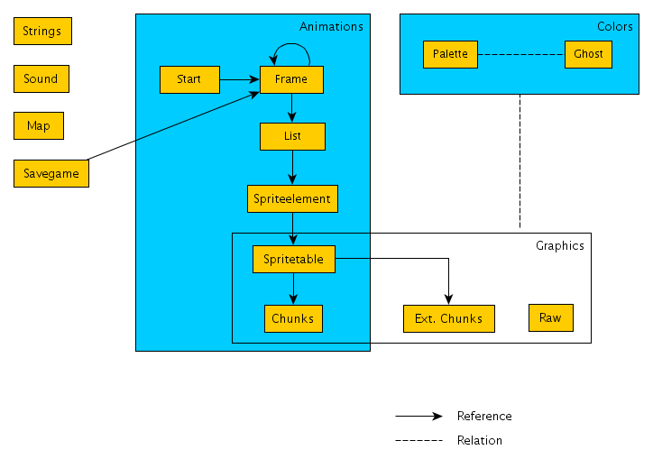
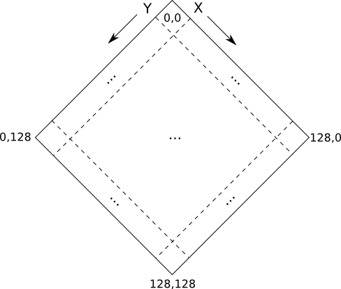

# Theme Hospital Format Specification

## General Information

This page intends to describe the data format specification of Bullfrog’s Theme Hospital.

(Notice that by now it’s mostly unstructured and stuff is randomly thrown in)

Some of the Theme Hospital files are compressed with Rob Northern Compression (RNC). You can find a compressor/decompressor at the first link down below. TH reads all of its file wether they are compressed or not. So you can overwrite all of the data files with their decompressed counterpart.

* [http://www.yoda.arachsys.com/dk/](http://www.yoda.arachsys.com/dk/)
* [http://freesynd.sourceforge.net/](http://freesynd.sourceforge.net/)
* [http://desyndicate.pbwiki.com/](http://desyndicate.pbwiki.com/)
* [http://wiki.multimedia.cx/index.php?title=Smacker](http://wiki.multimedia.cx/index.php?title=Smacker)
* [http://ffmpeg.mplayerhq.hu/](http://ffmpeg.mplayerhq.hu/)
* [http://paul.chavent.free.fr/libsyndicate/](http://paul.chavent.free.fr/libsyndicate/)
* [http://citybuilder.sourceforge.net/](http://citybuilder.sourceforge.net/)
* [http://syndicate.lubie.org/synd/html/synd_main.php](http://syndicate.lubie.org/synd/html/synd_main.php)
* [http://p214.ezboard.com/For-devs-Decrypting-the-map-code/fthemehospitalclinicfrm1.showMessage?topicID=244.topic](http://p214.ezboard.com/For-devs-Decrypting-the-map-code/fthemehospitalclinicfrm1.showMessage?topicID=244.topic)

| Position | Description |
|:--------|:-------|
| 682352 | the number of days each month has |

```
days = { 0x1f, 0x1c, 0x1f, 0x1e, 0x1f, 0x1e, 0x1f, 0x1f, 0x1e, 0x1f, 0x1e, 0x1f }
```

## Formats



A few notes on the notation used below:

* numbers are written with their decimal value, unless they begin with ‘0x’, which indicates a hexadecimal value
* file position counting begins with 0 (i.e. the first byte of a file has the number 0)
* “byte x – y” denotes a sequence of bytes beginning at position x and ending at position y (both inclusive); therefore that sequence has a length of (y – x + 1)
* byte-order is assumed to be little endian (if not stated otherwise)

### Palette

Palette Files contain 256 color triples (r/g/b).

              .-------------------.
    byte 0    | red   (Color 0)   |
              |-------------------|
    byte 1    | green (Color 0)   |
              |-------------------|
    byte 2    | blue  (Color 0)   |
              |-------------------|
    byte 3    | red   (Color 1)   |
              |-------------------|
    byte 4    | green (Color 1)   |
              |-------------------|
    byte 5    | blue  (Color 1)   |
              |-------------------|
      .       |         ...       |
      .       |-------------------|
      .       | red   (Color 255) |
              |-------------------|
    byte 765  | green (Color 255) |
              |-------------------|
    byte 766  | blue  (Color 255) |
              '-------------------'

Where each byte (red/green/blue) is in the range of [0x00 .. 0x3f]. Therefore it’s mostly convenient to multiply the bytes by 4, so the values range from 0 to 252.

### Ghost

These files contain mappings from a palette index to another palette index that is to be used if a pixel lies in a shadow or is transparent.

                          .---------------.
    byte 0 - 255          | Shadowmap 0   |
                          |---------------|
    byte 256 - 511        | Shadowmap 1   |
           .              |---------------|
           .              |      ...      |
           .              |---------------|
    byte 65,280 - 65,535  | Shadowmap 255 |
                          '---------------'

Each **Shadowmap** is an array of 256 bytes. To get a shadow-color for a pixel do the following:

* say the pixel has the palette index (color) **i**
* then lookup the shadow-index in the shadowmap (i.e. **si** = Shadowmapx[**i**] )
* use si as an index into the respective palette

### Animations

The general idea behind THs animation files can be summarized as follows:

* each animation consits of 1 or more frames
   * where every single frame knows the next frame in the animation sequence; this is cyclic, i.e. the last frame of an animation links to the first frame of that animation
* a frame is composed by many single graphics sprites (“Spriteelement”); thus a frame references some list in a list-file, with that list enumerating all the single sprites

To render a frame, you would typically do something linke this:

1. figure out where the frame is to be positioned on screen (let’s call that screenx and screeny)
2. draw each spriteelement at position screenx + element.offsetX, screeny + element.offsetY

#### Start

This file lists the first frame for each animation sequence in TH.

                        .-------------------------.
    byte 0 - 1          | Startframe, Animation 0 |
                        |-------------------------|
    byte 2 - 3          | unknown                 |
                        |-------------------------|
    byte 4 - 5          | Startframe, Animation 1 |
                        |-------------------------|
    byte 6 - 7          | unknown                 |
         .              |-------------------------|
         .              |          ...            |
         .              |-------------------------|
    byte 4n - (4n + 1)  | Startframe, Animation n |
                        |-------------------------|
                        | unknown                 |
                        |-------------------------|
                        |          ...            |
                        '-------------------------'

* **startframe** – uint16; an index of an entry in the framefile. entries in the framefile are 10 bytes in size, so absolute position = startframe * 10

#### Frame

Contains the single frames that are used in all animation sequences. Each entry is 10 bytes long.

                   .--------------------.
    byte 0 - 3     | listindex, frame 0 |
                   |--------------------|
    byte 4         | width,     frame 0 |
                   |--------------------|
    byte 5         | height,    frame 0 |
                   |--------------------|
    byte 6         | soundindex frame 0 |
                   |--------------------|
    byte 7         | flags      frame 0 |
                   |--------------------|
    byte 8 - 9     | nextindex, frame 0 |
                   |--------------------|
    byte 10 - 13   | listindex, frame 1 |
                   |--------------------|
    byte 14        | width,     frame 1 |
                   |--------------------|
    byte 15        | height,    frame 1 |
                   |--------------------|
    byte 16        | soundindex frame 1 |
                   |--------------------|
    byte 17        | flags      frame 1 |
                   |--------------------|
    byte 18 - 19   | nextindex, frame 1 |
         .         |--------------------|
         .         |        ...         |
         .         '--------------------'

* **listindex** – uint32; index of the elementlist in the listfile. absolut position in listfile = listindex * 2
* **width** – width of this frame, in pixels
* **height** – height of this frame, in pixels
* **soundindex** – If non-zero, then an index into the filetable of the sounds data file
* **flags** – bitmask of zero or more of the following flags:
   * **0x1** – start of animation
* **nextindex** – index of the next frame

#### List

Contains lists of spriteelements for each frame to render. Note that the graphics in a frame get rendered in the order of their appearence in such list.

A list is simply a sequence of **indices** (uint16), with 0xffff denoting the end of the list.

        .-----------.
        | list 0    |
        |-----------|
        | list 1    |
        |-----------|
        |    ...    |
        '-----------'

* **index** – uint16; index into the elements-file. absolute position in elements-file = index * 6

#### Spriteelement

Contains all Spriteelements used in all of the animations. Each entry is 6 bytes long.

                 .-----------------------------------.
    byte 0 - 1   | tabposition,      Spriteelement 0 |
                 |-----------------------------------|
    byte 2       | offsetX,          Spriteelement 0 |
                 |-----------------------------------|
    byte 3       | offsetY,          Spriteelement 0 |
                 |-----------------------------------|
    byte 4       | layerclass/flags, Spriteelement 0 |
                 |-----------------------------------|
    byte 5       | layerid,          Spriteelement 0 |
                 |-----------------------------------|
    byte 6 - 7   | tabposition,      Spriteelement 1 |
                 |-----------------------------------|
    byte 8       | offsetX,          Spriteelement 1 |
                 |-----------------------------------|
    byte 9       | offsetY,          Spriteelement 1 |
                 |-----------------------------------|
    byte 10      | layerclass/flags, Spriteelement 1 |
                 |-----------------------------------|
    byte 11      | layerid,          Spriteelement 1 |
         .       |-----------------------------------|
         .       |               ...                 |
         .       '-----------------------------------'

* **tabposition** – uint16; gives the absolute position in the associated Spritetable
* **offsetX** – uint8; this spriteelement’s x-offset (in pixels), regarding the whole frame/animation
* **offsetY** – uint8; this spriteelement’s y-offset
* **layerclass/flags** – uint8; the higher nibble contains the layerclass – this can take values from 0 to 12; the lower nibble contains some flags for rendering this spriteelement; flags can be OR’ed
   * known flags:
      * 0x1 – flip the image vertically
      * 0x2 – flip the image horizontally
      * 0x4 – draw the image with alpha 50%
      * 0x8 – draw the image with alpha 75%
* **layerid** – uint8; the layerid assigned to this spriteelement. spriteelements where the layerid is 0x0 or 0x1 are always rendered

The gamestate (see Savegame/ObjectInfo) contains a layerid (or 0) for each layerclass, so a Spriteelement must be rendered if the layerclass of it contains it layerid. (Example: Spriteelement is of layerclass 9 and has the layerid 6; if the layerclass in the gamestate contains layerif 6, then reder the Spriteelement)

### Spritetable

These files hold some index-information for the Graphics/Chunks files. Byteorder is little endian.

                      .-------------------.
    byte 0 - 3        | offset 0          |
                      |-------------------|
    byte 4            | width 0           |
                      |-------------------|
    byte 5            | height 0          |
       .              |-------------------|
       .              |        ...        |
       .              '-------------------'

There exists one entry for every one sprite.

* **offset** – uint32 is the position of this sprite in the Graphics/Chunks file
* **width** – its width
* **height** – its height.

### Graphics

A short note on error handling. There seems to be at least one confirmed error in the Graphics files of Theme Hospital. That is, the image in the datafile stores a few rows that exceed the real image width. TH just reads as much as it can and if it reaches the end of a row (but there is still data to read) it just wraps to the next row.

#### Raw

Raw Graphics files have a size of (width * height) bytes, where each byte represents one pixel of the image. The single bytes are indices into the resprective Palettes.

                      .-------------------.
    byte 0            | pixel 0           |
                      |-------------------|
    byte 1            | pixel 1           |
       .              |-------------------|
       .              |        ...        |
       .              |-------------------|
    byte (w * h - 1)  | pixel (w * h) - 1 |
                      '-------------------'

#### Chunks

The pixels are stored in chunks of variable length. Each chunk begins with a byte that determines this chunks type.

**b** denotes the byte's value

| Value	| Chunk type |
|:------|:-----------|
|b = 0  | end of current row |
|b > 0  | read the following b bytes, which are opaque pixels (indices in palette) |
|b < 0  | leave the following -b pixels transparent |

#### Extended Chunks

The pixels are stored in chunks of variable length. Each chunk begins with a byte that determines this chunks type.

**b** denotes the byte's value

|Value  |Chunk type  |
|:------|:-----------|
|b = 0           | end of current row |
|1 <= b <= 63    | read the following b bytes, which are opaque pixels (indices in palette) |
|64 <= b <= 127  | read the next byte (= palette index) and set the following (b – 60) pixels with that color |
|128 <= b <= 191 | leave the following (b – 128) pixels transparent (read nothing) |
|192 <= b <= 254 | read the next byte (= palette index) and set the following (b – 124) pixels with that color |
|b = 255         | read the next byte (count) and the byte after that (pal); set the following count pixels with color pal |

### Sound

The overall structure of a sound-file looks like this

            .-----------.
    WAV 0   | Sample 0  |
      .     |-----------|
      .     |    ...    |
      .     |-----------|
    WAV n   | Sample n  |
            |-----------|
            | filetable |
            |-----------|
            | info      |
            |-----------|
            | position  |
            '-----------'

* **filetable** – some info about the samples (such as original file name)
* **info** – information about the filetable (position, length)
* **position** – The very last 4 bytes of a Sound file are a uint32 position in the file. Located at that position is the info-data

#### Info

               .---------------------------.
    0 - 49     | unknown                   |
               |---------------------------|
    50 - 53    | uint32 filetable position |
               |---------------------------|
    54 - 57    | unknown                   |
               |---------------------------|
    58 - 61    | uint 32 filetable length  |
               |---------------------------|
    62 - 65    | uint32 filetable position |
               |---------------------------|
    66 - 177   | unknown                   |
               |---------------------------|
    178 - 181  | uint32 filetable position |
               |---------------------------|
    182 - 185  | unit32 filetable length   |
               |---------------------------|
    186 - 233  | unknown                   |
               '---------------------------'

* **filetable position** – absolute position of the filetable in the same file
* **filetable length** – length of the filetable

#### Filetable

The Filetable consists of (filetable length / 32) entries, where each entry is 32 byte long. The first entry (first 32 bytes of the filetable) seems to be a special entry.

    first entry
            .---------.
    0 - 31  | unknown |
            '---------'


    other entries
             .-----------------.
    0 - 17   | filename        |
             |-----------------|
    18 - 21  | uint32 position |
             |-----------------|
    22 - 25  | unknown         |
             |-----------------|
    26 - 29  | uint32 length   |
             |-----------------|
    30 - 31  | unknown         |
             '-----------------'

* **filename** – null terminated string with the original filename of a sound sample
* **position** – absolute position of the sample in the same file
* **length** – length (in bytes) of the sample

A sample is simply a byte sequence in [WAV format](http://en.wikipedia.org/wiki/WAV).

### Strings

String files contain all the Text that is used throughout the game. They come in different languages and thus make Theme Hospital a multilanguage game. Strings are stored as null-terminated character arrays.

                                     .-----------------------------.
    byte 0 - 1                       | Sectioncount (sec)          |
                                     |-----------------------------|
    byte 2 - 3                       | Stringcount Section 0 (sc0) |
        .                            |-----------------------------|
        .                            |            ...              |
        .                            |-----------------------------|
    byte (sec * 2) - (sec * 2 + 1)   | Stringcount Section sec     |
                                     |-----------------------------|
        .                            | Section 0, String 0         |
        .                            |-----------------------------|
        .                            | Section 0, String 1         |
                                     |-----------------------------|
                                     |            ...              |
                                     |-----------------------------|
                                     | Section 0, String sc0       |
                                     |-----------------------------|
                                     | Section 1, String 0         |
                                     |-----------------------------|
                                     |            ...              |
                                     '-----------------------------'

All Theme Hospital Strings-files are made up of 68 sections.

* **sectioncount** – uint16
* **stringcount** – uint16

### Level

Levels/Maps in Theme Hospital have a size of 128 x 128 tiles.

    (see further below for detailed descriptions of the fields)
                            .-----------------------------.
    byte 0                  | number of players           |
                            |-----------------------------|
    byte 1                  | unknown                     |
                            |-----------------------------|
    byte 2 - 9              | unknown                     |
                            |-----------------------------|
    byte 10 - 17            | unknown                     |
                            |-----------------------------|
    byte 18 - 25            | unknown                     |
                            |-----------------------------|
    byte 26 - 33            | unknown                     |
                            |-----------------------------|
    byte 34 - 131,105       | Map                         |
                            |-----------------------------|
    byte 131,106 - 163,873  | Parcel information          |
                            |-----------------------------|
    byte 163,874 - 163,875  | unknown                     |
                            |-----------------------------|
    byte 163,876            | camera pos (x) player 1     |
                            |-----------------------------|
    byte 163,877            | camera pos (y) player 1     |
                            |-----------------------------|
    byte 163,878            | camera pos (x) player 2     |
                            |-----------------------------|
    byte 163,879            | camera pos (y) player 2     |
                            |-----------------------------|
    byte 163,880            | camera pos (x) player 3     |
                            |-----------------------------|
    byte 163,881            | camera pos (y) player 3     |
                            |-----------------------------|
    byte 163,882            | camera pos (x) player 4     |
                            |-----------------------------|
    byte 163,883            | camera pos (y) player 4     |
                            |-----------------------------|
    byte 163,884            | heliport pos (x) player 1   |
                            |-----------------------------|
    byte 163,885            | heliport pos (y) player 1   |
                            |-----------------------------|
    byte 163,886            | heliport pos (x) player 2   |
                            |-----------------------------|
    byte 163,887            | heliport pos (y) player 2   |
                            |-----------------------------|
    byte 163,888            | heliport pos (x) player 3   |
                            |-----------------------------|
    byte 163,889            | heliport pos (y) player 3   |
                            |-----------------------------|
    byte 163,890            | heliport pos (x) player 4   |
                            |-----------------------------|
    byte 163,891            | heliport pos (y) player 4   |
                            |-----------------------------|
    byte 163,892 - 163,895  | has something to do with how far we can scroll
                            |-----------------------------|
    byte 163,896 - 163,947  | unknwon                     |
                            '-----------------------------'

* **number of players** – is the number of players that can simultaniously play this map (multiplayer); can take values from 1 to 4
* **camera pos (x) player k** – initial camera position for player k; can take values from ? to ?
* **camera pos (y) player k** – initial camera position for player k; can take values from ? to ?
* same is probably true for the heliports x/y coordinates

#### Map

There are 128 x 128 map-tiles, where each tile consists of 8 bytes.



                .----------------------.
    byte 0 - 1  | item / animation (?) |
                |----------------------|
    byte 2      | layer 1              |
                |----------------------|
    byte 3      | layer 2              |
                |----------------------|
    byte 4      | layer 3              |
                |----------------------|
    byte 5 - 7  | unknown              |
                '----------------------'

* **animation** – not quite sure about this one. of there is a value > 0 here, TH draws some animation on that tile
* **item** – a value > 0 causes TH to place an ingame item on that tile (trash-can, coke-machine, …)
* **layer 1** – the first layer of graphics that is drawn; references graphics from Data/VBLK-0.DAT
* **layer 2** (NE wall) and **layer 3** (NW wall) – the second and third layers that get drawn if their respective value is >= 1

TH does not use the “layer x” values directly to index an entry in Data/VBLK-0.DAT, but uses some mapping. The map is located at [0xA83E0 or 0xA6BE0] in winmain.exe and can be read as follows.

* the first 80 bytes index an entry directly
* the last 152 bytes have to be increased by 81; the result indexes an entry directly

Here is the map shown as a Java array:

     int[[]] tileMap = {
       // 0     1     2     3     4     5     6     7     8     9     a     b     c     d     e     f
       // 0
       0x01, 0x02, 0x03, 0x04, 0x05, 0x06, 0x07, 0x08, 0x09, 0x0a, 0x0b, 0x0c, 0x0d, 0x0e, 0x0f, 0x10,
       // 1
       0x11, 0x12, 0x13, 0x14, 0x15, 0x16, 0x17, 0x18, 0x19, 0x1a, 0x1b, 0x1c, 0x1d, 0x1e, 0x1f, 0x20,
       // 2
       0x21, 0x22, 0x23, 0x24, 0x25, 0x26, 0x27, 0x28, 0x29, 0x2a, 0x2b, 0x2c, 0x2d, 0x2e, 0x2f, 0x30,
       // 3
       0x31, 0x32, 0x33, 0x34, 0x35, 0x36, 0x37, 0x38, 0x39, 0x3a, 0x3b, 0x3c, 0x3d, 0x3e, 0x3f, 0x40,
       // 4
       0x41, 0x42, 0x43, 0x44, 0x45, 0x46, 0x47, 0x48, 0x49, 0x4a, 0x4b, 0x4c, 0x4d, 0x4e, 0x4f, 0x50,
       // 5
       0x52, 0x53, 0x54, 0x55, 0x56, 0x57, 0x58, 0x59, 0x5a, 0x5b, 0x5c, 0x5d, 0x5e, 0x5f, 0x60, 0x61,
       // 6
       0x62, 0x63, 0x64, 0x65, 0x66, 0x67, 0x68, 0x69, 0x6a, 0x6b, 0x6c, 0x6d, 0x6e, 0x6f, 0x70, 0x71,
       // 7
       0x72, 0x73, 0x74, 0x75, 0x76, 0x77, 0x78, 0x79, 0x7a, 0x7b, 0x7c, 0x7d, 0x7e, 0x7f, 0x80, 0x81,
       // 8
       0x84, 0x85, 0x88, 0x89, 0x8c, 0x8d, 0x51, 0x51, 0x51, 0x51, 0x51, 0x51, 0x8d, 0x8e, 0x51, 0x51,
       // 9
       0x51, 0x51, 0x8e, 0x8f, 0xd5, 0xd6, 0x9c, 0xcc, 0xcd, 0xce, 0xcf, 0xd0, 0xd1, 0xd2, 0xd3, 0xd4,
       // a
       0xb3, 0xaf, 0xb0, 0xb1, 0xb2, 0xb3, 0xb4, 0xb5, 0xb6, 0xb7, 0xb8, 0xb9, 0xb3, 0xb3, 0xb4, 0xb4,
       // b
       0xba, 0xbb, 0xbc, 0xbd, 0xbe, 0xbf, 0xc0, 0xc1, 0xc2, 0xc3, 0xc4, 0xc5, 0xc6, 0xc7, 0xc8, 0xc9
       // c
       0xca, 0xcb, 0x51, 0x82, 0x83, 0x86, 0x87, 0x8a, 0x8b, 0x92, 0x93, 0x94, 0x95, 0x96, 0x97, 0x98,
       // d
       0x99, 0x9a, 0x9b, 0x51, 0x9d, 0x9e, 0x9f, 0xa0, 0xa1, 0xa2, 0xa3, 0xa4, 0xd7, 0xd8, 0xd9, 0xda,
       // e
       0xdb, 0xdc, 0xdd, 0xde, 0xdf, 0xe0, 0xe1, 0xe2
     };

#### Parcel information

This contains the information about parcels the player might buy during the game, and the parcel that the player owns at the beginning of a level. There are 128 x 128 map-tiles, where each tile consists of 2 bytes.

                .-----------.
    byte 0 - 1  | parcel id |
                '-----------'

* **parcel id** – an unsigned int16 that holds the id of a parcel; TH displays the id in the map screen, and uses it to keep track of the tiles belonging to a specific parcel
   * the parcel that is initially owned by the player has the player’s id (so in single player games it’s always 1; in multiplayer games the second player has id 2 and so on)

If you buy a parcel in the game, TH will copy the corresponding tiles from the Level-File into memory/savegame.

### Savegames

    byte 13 - 131,084         | Map
                              |-------------------
    byte 131,085 - 393,584    | Ingame Objects Info (in blocks of 175 bytes)
                              |-----------------
    byte 399,030              | uint8 day
                              |-----------------
    byte 399,031              | uint8 month
                              |-----------------
    byte 399,968 - 404,664    | Hospital Data / Player 1
                              |-----------------------------
    byte 404,665 - 409,361    | Hospital Data / Player 2
                              |-----------------------------
    byte 409,362 - 414,058    | Hospital Data / Player 3
                              |-----------------------------
    byte 414,059 - 418,755    | Hospital Data / Player 4
                              |-----------------------------

* **ingame objects info** – there is limited space for the ingame objects, therefore yielding a maximum objects count of 1500
* **Hospital Data** – this contains all the data (money, info about treatments, statistics, …) for the different players

<!-- end of list -->

    # Temporary #
    
    400,562 sint32 treatment charge gp $
    400,566 sint32 treatment charge gp %
    400,570 sint32 money earned gp $
    400,580 uint16 recoveries gp
    400,582 uint16 fatalities gp
    400,586 uint16 turned away gp
    400,588 sint32 reputation bloaty head

#### Map

There are 128 x 128 map-tiles, where each tile consists of 8 bytes.

                .----------------------.
    byte 0 - 1  | object info          |
                |----------------------|
    byte 2      | layer 1              |
                |----------------------|
    byte 3      | layer 2              |
                |----------------------|
    byte 4      | layer 3              |
                |----------------------|
    byte 5      | unknown              |
                |----------------------|
    byte 6      | extra                |
                |----------------------|
    byte 7      | read-only tile (?)   |
                '----------------------'

* **object info** – index into the Ingame Objects Info part
* **layer 0**, **layer 1** and **layer 2** – same as in Level/Map
* **extra** – this determines some extra properties for the tile
   * high nibble – shadow (note: only draw the NE wall shadow if there is a wall on layer 1)
      * 0x1 upper triangle (sprite 75 in data/vblk-0.dat)
      * 0x2 NE wall (sprite 156 in data/vblk-0.dat)
      * 0x3 NE wall & upper triangle
      * 0x4 full tile (sprite 74 in data/vblk-0.dat)
      * 0x5 full tile
      * 0x6 NE wall & full tile
      * 0x7 NE wall & full tile
      * 0x8 no shadow
      * 0x9 upper triangle
      * 0xA NE wall
      * 0xB NE wall & upper triangle
      * 0xC full tile
      * 0xD full tile
      * 0xE NE wall & full tile
      * 0xF NE wall & full tile
   * low nibble – litter
      * 0x1 can (3737 in data/vfra-1.ani)
      * 0x2 banana peel (3738 in data/vfra-1.ani)
      * 0x3 paper (3739 in data/vfra-1.ani)
      * 0x4 rat blood (4533 in data/vfra-1.ani)
      * 0x5 vomit (3741 in data/vfra-1.ani)
      * 0x6 urine (4542 in data/vfra-1.ani)
      * 0x7 rat hole NE (3742 in data/vfra-1.ani)
      * 0x8 rat hole NW

#### Ingame Objects Info

The info is stored in a sequence of 175 bytes.

                     .-------------------.
    byte 0 - 7       | unknown           |
                     |-------------------|
    byte 8 - 9       | frame index       |
                     |-------------------|
    byte 29          | layerclass 0      |
                     |-------------------|
    byte 30          | layerclass 1      |
                     |-------------------|
    byte 31          | layerclass 2      |
                     |-------------------|
    byte 32          | layerclass 3      |
                     |-------------------|
    byte 33          | layerclass 4      |
                     |-------------------|
    byte 34          | layerclass 5      |
                     |-------------------|
    byte 35          | layerclass 6      |
                     |-------------------|
    byte 36          | layerclass 7      |
                     |-------------------|
    byte 37          | layerclass 8      |
                     |-------------------|
    byte 38          | layerclass 9      |
                     |-------------------|
    byte 39          | layerclass 10     |
                     |-------------------|
    byte 40          | layerclass 11     |
                     |-------------------|
    byte 41          | layerclass 12     |
                     |-------------------|
    byte 55 - 58     | times used (?)    |

* **frame index** – uint16; just like Animations/Start, this is the index of an entry in the framefile. entries in the framefile are 10 bytes in size, so absolute position = frame index * 10
* **times used** – sint 32; this is displayed when you mouseover a bench or a drinks machine as how often it was used
* **layerclass n** – contains the layerid for layerclass n (see Animation/Spriteelement on how to use this); NOTE: the id is divided by 2, so to get the real id, multiply this value by 2

#### Hospital Data

The info is stored in a sequence of 4697 bytes.

                         .-------------------
    byte 0 - arbitrary   | null-terminated string / hospital name
                         |-------------------
    byte 53 - 56         | sint32 money
                         |-------------------
    byte 61 - 64         | sint32 loan
                         |-------------------
    byte 459 - 460       | uint16 % population
                         |-------------------
    byte 489 - 490       | uint16 people cured
                         |-------------------
    byte 491 - 492       | uint16 deaths
